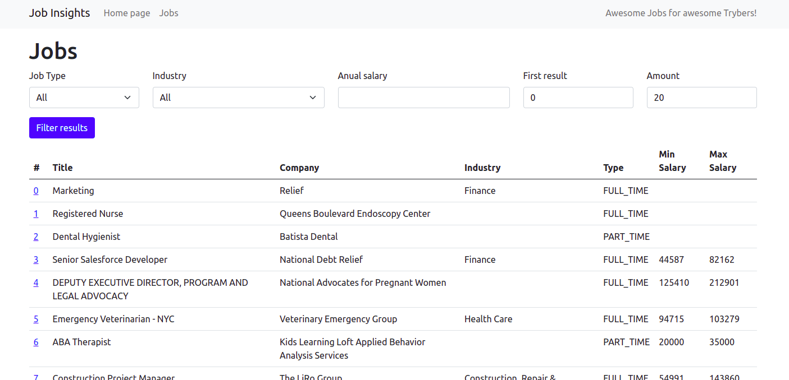

<h1>💼 Job Insights 🏢</h1>

 

<h2>Índice</h2>
<h4>- <a href="#context">Contexto</a></h4>
<h4>- <a href="#tecnologies">Técnologias utilizadas</a></h4>
<h4>- <a href="#development">Desenvolvimento</a></h4>
<h4>- <a href="#howtouse">Como executar o projeto</a></h4>

<h2 id="context">Contexto</h2>

O Jobs Insights é uma site de vagas de emprego, nele é possivel visualizar, pesquisar e filtrar diversas vagas de emprego.

Neste projeto sou autor das funções lêem, filtram e manipulam os dados para serem renderizados no front-end. O projeto foi desenvolvido durante o curso da Trybe com o objetivo de consolidar os estudos com Python, foi realizado em agosto de 2022, no módulo de Ciência da Computação.

O front-end foi desenvolvido pela escola Trybe

<h2 id="tecnologies">Técnologias utilizadas</h2>

<ul>
  <li>Python</li>
  <li>Flask</li>
</ul>

<h2 id="development">Desenvolvimento</h2>

Neste projeto pude implementar muita lógica de programação utilizando Python.

Foi possível realizar diversas funções para abrir arquivos, ler dados, manipulá-los e filtrá-los, também foi possível criar uma rota e testes unitários em Python.

Os arquivos que trabalhei são src/templates/jobs.py, src/templates/insights.py e src/tests

<h2 id="howtouse">Como executar o projeto</h2>

  1. Clone o repositório
    * `git clone git@github.com:gustavo-pd/project-job-insights`.
    * Entre na pasta do repositório que você acabou de clonar:
      * `cd project-job-insights`
 

  2. Crie o ambiente virtual para o projeto:
    * `python3 -m venv .venv && source .venv/bin/activate`
 

  3. Instale as dependências:
    * `python3 -m pip install -r dev-requirements.txt`
 

  4. Rode o flask na raiz do projeto:
    * `flask run`
 

  4. Acesse no seu navegador:
    * `http://127.0.0.1:5000`
 
